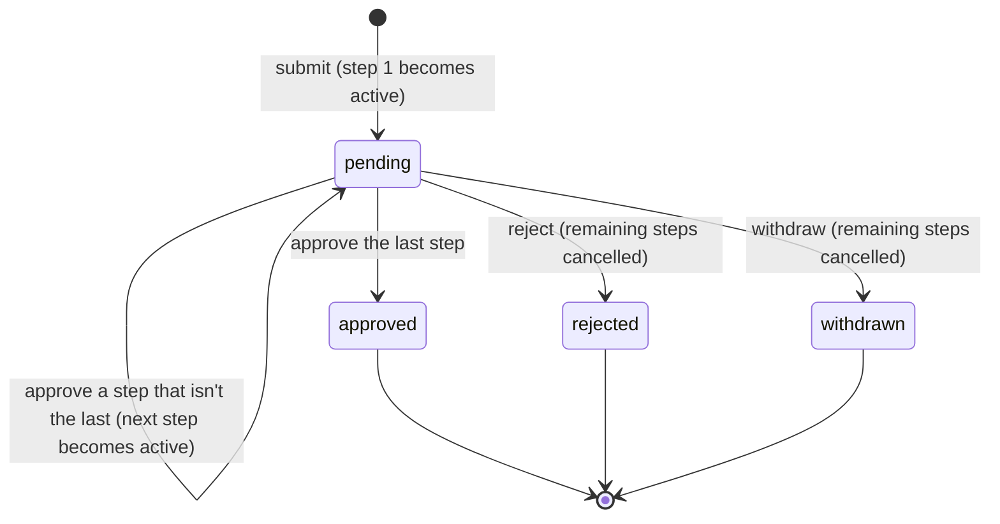

# Approvals API

A workflow and approval engine built with FastAPI and PostgreSQL. A request (say, a purchase order) moves through an ordered set of approval steps. Each step is assigned to an approver group and has a deadline. Every state change is written to an audit trail, and a background worker escalates steps that miss their deadline.

> **Status:** in progress. The core approval flow works end to end: submit, approve, reject and withdraw, with an audit trail. Requests can be listed with filters and cursor pagination, and a background worker escalates steps that miss their deadline.

## Tech stack

| Area | Choice |
| --- | --- |
| API | FastAPI (Python 3.12) |
| Database | PostgreSQL 16, SQLAlchemy 2.0 (async) with asyncpg, Alembic migrations |
| Auth | OAuth2 password flow issuing JWTs (PyJWT), Argon2 password hashing (pwdlib) |
| Config | pydantic-settings (environment variables) |
| Dependencies | pip-tools (`requirements.in` compiled to pinned `requirements.txt`) |
| Tests / lint | pytest, ruff |
| Runtime | Docker, Docker Compose |
| CI | GitHub Actions |

## Running it

### With Docker (recommended)

```bash
docker compose up --build
```

Compose starts Postgres, applies migrations with a one-shot `migrate` service, then starts the API and the SLA worker. The API runs at http://localhost:8000. Interactive docs are at http://localhost:8000/docs.

### Locally

This needs Python 3.12 and a PostgreSQL server you can reach.

```bash
python -m venv .venv
.venv\Scripts\activate          # Windows
source .venv/bin/activate       # macOS / Linux
pip install pip-tools
pip-sync requirements.txt requirements-dev.txt
cp .env.example .env            # then point DATABASE_URL at your database
alembic upgrade head
uvicorn app.main:app --reload
```

### Tests and lint

```bash
pytest
ruff check . && ruff format --check .
```

The database tests (migrations, constraints) run against a separate `approvals_test` database, which Compose creates on first start, so `docker compose up db` is enough to run them. Without a reachable database they're skipped locally. CI sets `REQUIRE_DATABASE=1`, so there they fail instead.

### Creating the first admin

Self-registration always creates a regular user, so the first admin is created from the command line:

```bash
docker compose run --rm api python -m app.cli create-admin --email admin@example.com --name "Ada Admin"
```

Then open http://localhost:8000/docs, click **Authorize**, and log in with that email and password.

## Endpoints so far

| Method | Path | Purpose |
| --- | --- | --- |
| GET | `/health` | Liveness: the process is running. Doesn't touch the database |
| GET | `/health/ready` | Readiness: the database answers. Returns 503 if it doesn't |
| POST | `/auth/register` | Create an account (always a regular user) |
| POST | `/auth/token` | Log in with email and password (OAuth2 form) and get a bearer token |
| GET | `/users/me` | The logged-in user and their groups |
| GET | `/groups` | List approver groups |
| POST | `/groups` | Create a group (admin) |
| PUT | `/groups/{id}/members/{user_id}` | Add a user to a group (admin). Adding an existing member is not an error |
| DELETE | `/groups/{id}/members/{user_id}` | Remove a user from a group (admin) |
| GET | `/workflows` | List active workflows (admins can add `?include_inactive=true`) |
| GET | `/workflows/{id}` | A workflow and its steps |
| POST | `/workflows` | Create a workflow with its ordered steps (admin) |
| PATCH | `/workflows/{id}` | Rename, edit the description, or deactivate (admin) |
| PUT | `/workflows/{id}/steps` | Replace all steps (admin). Requests already submitted are unaffected |
| GET | `/requests` | Requests you can see, newest first. Filters: `status`, `workflow_id`, `mine`, `assigned_to_me`. Cursor-paginated |
| POST | `/requests` | Submit a request. Its first step starts immediately with its deadline |
| GET | `/requests/{id}` | A request and its steps. Visible to the requester, admins, and approvers on it |
| GET | `/requests/{id}/history` | The request's audit trail |
| POST | `/requests/{id}/approve` | Approve the current step (approvers in that step's group). The last approval approves the request |
| POST | `/requests/{id}/reject` | Reject at the current step. A comment is required |
| POST | `/requests/{id}/withdraw` | The requester cancels their own pending request |

Every decision body includes the `version` of the request the client last loaded, e.g. `{"version": 3, "comment": "OK"}`. If the request has changed since, the API returns `409` and nothing is applied.

### Listing and pagination

`GET /requests?assigned_to_me=true&limit=20` returns:

```json
{
  "items": [{ "id": "…", "title": "New laptop", "status": "pending", "current_step": { "name": "Manager review", "due_at": "…" } }],
  "next_cursor": "eyJjIjogIjIwMjYtMDktMjNUMTQ6MDU6MDkuMTIzNDU2KzAwOjAwIiwgImkiOiAi…"
}
```

Pass `next_cursor` back as `?cursor=` for the next page. It's `null` on the last page.

## SLA escalation worker

`python -m app.worker` (the `worker` service in Compose) checks for overdue steps every `WORKER_POLL_SECONDS`. A step is overdue when it's active and past its `due_at`. For each one, the worker sets `escalated_at` and adds an `escalated` event to the request's history, with how long it was overdue. The worker is the "actor", so `actor_id` is `null`. Sending emails or chat messages is out of scope; the audit event is where a notifier would hook in.

It's safe to run several copies (`docker compose up --scale worker=3`). On `SIGTERM` it finishes the current batch and exits.

## Request lifecycle



Who can do what:

- **Approve or reject:** members of the current step's approver group. Being an admin isn't enough.
- **Separation of duties:** you can't decide on your own request, and one person can't approve two steps of the same request.
- **Withdraw:** only the requester.

## Data model

| Table | Holds |
| --- | --- |
| `users` | Accounts. `is_admin` gates workflow management |
| `approval_groups`, `group_memberships` | Groups of approvers (e.g. Finance). A user can belong to several |
| `workflows`, `workflow_steps` | Reusable templates: ordered steps, each with an approver group and an SLA in hours |
| `approval_requests` | A submitted request, its overall status and a `version` for optimistic locking |
| `request_steps` | The request's own copy of its workflow's steps, with per-step status, deadline and decision |
| `audit_events` | Append-only history of everything that happened to a request |

## Managing dependencies

Direct dependencies are listed in `requirements.in` (runtime) and `requirements-dev.in` (tests and tooling). After editing either file, regenerate the pinned lockfiles:

```bash
pip-compile requirements.in
pip-compile requirements-dev.in
pip-sync requirements.txt requirements-dev.txt
```

The dev file is constrained by `-c requirements.txt`, so packages shared by both files always resolve to the same version.

## Design notes

- **Separate liveness and readiness checks.** If the database goes down, `/health/ready` fails so traffic can be routed away, but `/health` keeps passing, so an orchestrator doesn't restart API containers that are healthy. Restarting them wouldn't fix the database anyway.
- **pip-tools over plain `requirements.txt`.** Every transitive dependency is pinned, so local runs, CI and the Docker image install exactly the same versions. The `.in` files stay short and readable.
- **Non-root container.** The image runs as an unprivileged `appuser`.
- **Requests copy their workflow's steps.** When a request is submitted, its steps are copied into `request_steps`. Editing a workflow later only affects new requests, never ones already waiting for approval.
- **Optimistic locking on requests.** Every update to a request includes `WHERE version = <the version that was read>`. If two approvers act on the same request at once, the second update matches no rows and fails, rather than silently overwriting the first decision.
- **The audit trail is append-only in the database.** A trigger rejects `UPDATE` and `DELETE` on `audit_events`, so the history can't be rewritten even by a bug in the application.
- **Enums are stored as `VARCHAR` plus `CHECK`, not native Postgres `ENUM`s.** Adding a value then only means changing a constraint in a migration. Changing a native `ENUM` type is more awkward.
- **Partial indexes for the hot queries.** The SLA worker's "overdue and not yet escalated" lookup and the "assigned to my groups" lookup each have an index covering only active steps, so these indexes stay small as finished requests pile up.
- **Migrations run as a separate step,** not on API startup, so several API instances never race to migrate the same database.
- **Migration tests.** CI upgrades and downgrades the schema twice, then runs `alembic check` to fail the build if a model changed without a matching migration.

- **Short-lived JWTs, but the user is still loaded on every request.** The token proves who you are, but whether you're active, an admin, or in a group is read fresh from the database each time. Deactivating someone or removing them from a group takes effect immediately, instead of when their token expires. It costs one indexed lookup per request. A stateless check (trusting what's in the token) would scale further, but would need a revocation list.
- **The JWT algorithm is pinned on decode.** The server never lets the token's own header choose the algorithm, which blocks the classic `alg: none` attack (there's a test for it).
- **Login doesn't reveal which emails exist.** A wrong password and an unknown email get the same response, and an unknown email still runs a password-hash check, so response time doesn't give it away either.
- **Password hashes upgrade themselves.** On login, a hash made with older Argon2 settings is replaced with one using the current settings.
- **Duplicate emails are caught by the database's unique constraint,** not by checking first. A "check, then insert" approach can let two simultaneous registrations for the same email both through.
- **The dev JWT secret refuses to run in production.** If `APP_ENV` isn't `development` and `JWT_SECRET` still has the placeholder value published in this repo, the app won't start.

- **The service layer doesn't know about HTTP.** Services raise domain errors (`NotFound`, `Conflict`, `InvalidInput`), and one exception handler turns them into status codes. The same logic can be called from routes, the CLI and the background worker.
- **404 instead of 403 for requests you can't see.** Someone outside a request can't tell whether its id exists.
- **Workflows are deactivated, not deleted.** Past requests still point to them, and the audit trail should never lose what a request was submitted against.
- **Server-generated columns come back in the INSERT itself** (`eager_defaults`). With async SQLAlchemy, reading an unloaded `created_at` would need a hidden extra query, which async code can't run implicitly.

- **Optimistic locking, not row locks.** Approvals are rare and conflicts rarer, so instead of holding `SELECT ... FOR UPDATE` locks, each decision is checked twice:
  1. The client sends the `version` it saw. If the request has changed since, that's a 409.
  2. On write, the `UPDATE` includes `WHERE version = <the version that was loaded>`. This catches two approvers whose requests both passed the first check at the same moment. A test forces exactly that race with two database sessions.
- **Every decision rewrites the request row, even when only a step changed.** Otherwise approving a middle step wouldn't touch `approval_requests`, the version wouldn't change, and the lock above would never trigger.
- **One transaction per decision.** The step change, the request's status and the audit event are committed together. The race test checks that the losing approval leaves no audit event behind.

- **Cursor pagination, not `OFFSET`.** Each cursor encodes the `(created_at, id)` of the last row on the page, and the next page continues with `WHERE (created_at, id) < (…)`. Every page is an index range scan, however deep you go. Rows inserted while someone is paging can't push an item onto two pages, and a test checks this. The tradeoff is no "jump to page 7", which a work queue doesn't need. `id` breaks ties between rows created at the same instant.
- **"Assigned to me" uses the same rules as approving.** The filter excludes your own requests and ones where you already approved an earlier step, so the list only shows requests where you'll actually be allowed to decide.
- **Visibility is enforced in SQL for lists.** The same rule as viewing a single request is written as `EXISTS` subqueries, so filtering and pagination happen in the database, not by filtering results in Python.

- **Postgres is the job queue.** The worker claims overdue steps with `SELECT … FOR UPDATE SKIP LOCKED`. Parallel workers each skip rows another worker has locked, so there's no double escalation and no waiting on each other. A test holds one worker's lock open and checks that a second worker takes the other row straight away. Redis with Celery or RQ would add a second system to run and keep in step with the database, which this load doesn't justify.
- **Exactly-once escalation without a separate job table.** Setting `escalated_at` and writing the audit event happen in one transaction, and the worker only claims steps where `escalated_at IS NULL`. If a worker crashes mid-batch, the transaction rolls back and another worker picks the rows up. When real notifications are added they'd go through an outbox table, since an email can't be rolled back.
- **The partial index needs a literal.** The overdue query inlines `status = 'active'` instead of sending it as a bound parameter. Postgres only uses the partial index `WHERE status = 'active' AND escalated_at IS NULL` when it can see the literal value while planning the query.
- **Escalation doesn't change the request's version.** It only flags the step, so an approver who is mid-decision doesn't get a 409 because the worker happened to run.
- **The backlog drains without waiting.** When a batch comes back full, the worker goes again immediately and only sleeps once it's caught up. A failing batch is logged and retried on the next tick rather than crashing the process.
