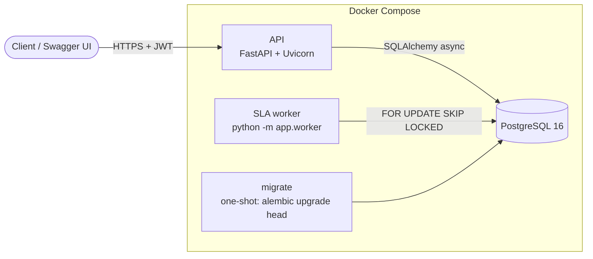
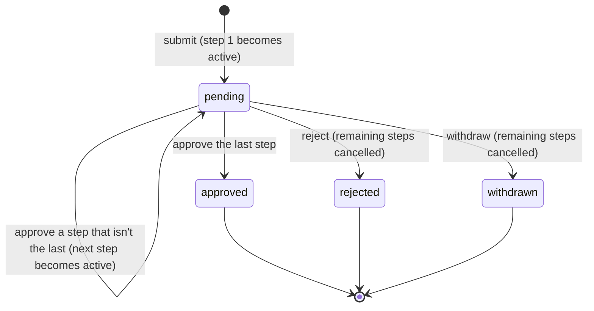
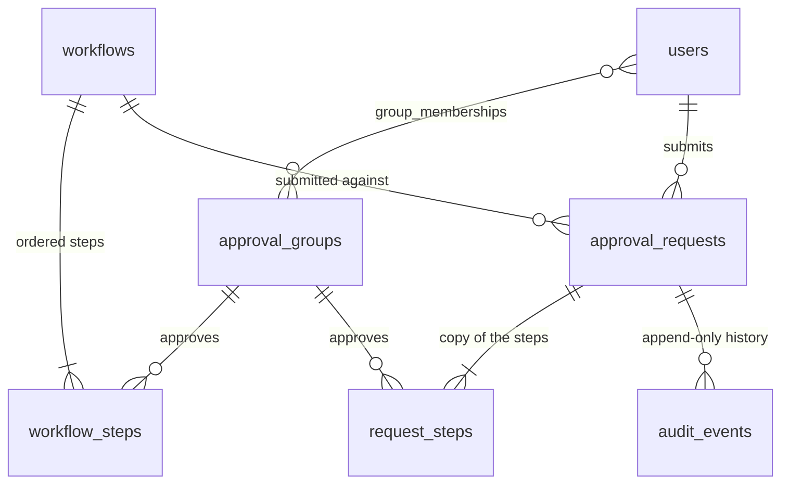

# Approvals API

[](https://github.com/YoussefBarada96/approvals-api/actions/workflows/ci.yml)

A workflow and approval engine: a FastAPI service backed by PostgreSQL, with a background worker.

A request, say a purchase order, moves through an ordered series of approval steps. Each step belongs to a group of approvers ("Managers", then "Finance") and has a deadline. Every decision is recorded in an audit trail that can only be added to. A background worker escalates steps that miss their deadline.

The domain is simple on purpose. The interesting part is getting the unglamorous things right: concurrent decisions, who is allowed to do what, a trustworthy history, and background work that is safe to scale out.

## Highlights

- **Two approvers can't both win a race.** Optimistic locking is checked twice: against the version the client saw, and again in the database's `UPDATE`. A test runs two real database sessions against each other to prove the loser gets a 409 and leaves nothing behind.
- **Postgres doubles as the job queue.** The SLA worker claims overdue steps with `SELECT … FOR UPDATE SKIP LOCKED`, so any number of workers can run side by side without escalating the same step twice. No Redis or Celery.
- **The audit trail can't be rewritten.** A database trigger rejects `UPDATE` and `DELETE` on the audit table, so even a bug in the application can't change history.
- **Separation of duties.** You can't approve your own request, one person can't approve two steps of the same request, and being an admin doesn't make you an approver.
- **Cursor pagination.** Lists page by `(created_at, id)` instead of `OFFSET`, so pages stay fast and consistent while new requests arrive.
- **Tested against real Postgres.** The locking, triggers, `SKIP LOCKED` behaviour and migrations are exercised against an actual database, not mocks. CI also runs `alembic check` to catch models that have drifted from their migrations.

## Quick start

You need Docker.

```bash
docker compose up --build
docker compose run --rm api python -m app.cli seed-demo
```

The first command starts Postgres, runs migrations, then starts the API and the worker. The second loads demo data: a two-step "Purchase order" workflow and four users. Every demo user's password is `demo-password-123`.

| User | Role |
| --- | --- |
| `alice@example.com` | Submits requests |
| `mo@example.com` | Approver in **Managers** (step 1, 24h deadline) |
| `fay@example.com` | Approver in **Finance** (step 2, 48h deadline) |
| `admin@example.com` | Admin: manages groups and workflows |

Then open **http://localhost:8000/docs** and walk through it:

1. Click **Authorize** and log in as `alice@example.com`. Call `GET /workflows` to get the workflow id, then `POST /requests` with `{"workflow_id": "…", "title": "New laptop", "details": {"amount": 1800}}`.
2. Log in as `mo@example.com`. `GET /requests?assigned_to_me=true` shows the request. Approve it with `POST /requests/{id}/approve` and `{"version": 1}`.
3. Log back in as `alice@example.com` and try `POST /requests/{id}/withdraw` with `{"version": 1}`. You get a `409`, because Mo's approval moved the request to version 2. A decision based on an out-of-date view is never applied.
4. Log in as `fay@example.com` and approve with `{"version": 2}`. The request is now `approved`.
5. `GET /requests/{id}/history` shows every step, who did it, and when.

## Architecture



The API and the worker share the same service layer. The API and the worker can each run as several copies. Migrations run once, before either starts.

```
app/
  main.py          FastAPI app, routers, domain-error handler
  routes/          HTTP layer: parse input, call a service, shape output
  services/        Business logic; raises domain errors, knows nothing about HTTP
    decisions.py     approve / reject / withdraw state machine
    escalations.py   SLA escalation (SKIP LOCKED)
    requests.py      submit, visibility rules, listing
  models/          SQLAlchemy models
  schemas/         Pydantic request/response models
  worker.py        Escalation worker process
  cli.py           create-admin, seed-demo
migrations/        Alembic migrations (0001 schema, 0002 listing index)
tests/             pytest: unit tests plus API and service tests against Postgres
```

## Request lifecycle



| Action | Who |
| --- | --- |
| Approve or reject | Members of the **current** step's approver group, except the requester and anyone who approved an earlier step of the same request. Rejecting requires a comment |
| Withdraw | The requester only |
| View a request and its history | The requester, admins, and members of any group with a step on it. Everyone else gets `404` |

## API

| Method | Path | Purpose |
| --- | --- | --- |
| GET | `/health` | Liveness: the process is up. Doesn't touch the database |
| GET | `/health/ready` | Readiness: the database answers. `503` if not |
| POST | `/auth/register` | Create an account (always a regular user) |
| POST | `/auth/token` | Log in (OAuth2 password form: email as username) and get a bearer token |
| GET | `/users/me` | The logged-in user and their groups |
| GET | `/groups` | List approver groups |
| POST | `/groups` | Create a group (admin) |
| PUT / DELETE | `/groups/{id}/members/{user_id}` | Add or remove a member (admin). Adding an existing member is not an error |
| GET | `/workflows`, `/workflows/{id}` | Active workflows and their steps (admins can add `?include_inactive=true`) |
| POST | `/workflows` | Create a workflow with ordered steps (admin) |
| PATCH | `/workflows/{id}` | Rename, edit the description, or deactivate (admin) |
| PUT | `/workflows/{id}/steps` | Replace all steps (admin). Requests already submitted are unaffected |
| GET | `/requests` | Requests you can see, newest first. Filters: `status`, `workflow_id`, `mine`, `assigned_to_me`. Paginated with `limit` and `cursor` |
| POST | `/requests` | Submit a request |
| GET | `/requests/{id}`, `/requests/{id}/history` | A request with its steps, and its audit trail |
| POST | `/requests/{id}/approve`, `/reject`, `/withdraw` | Decide on the current step, or withdraw |

Decision bodies carry the `version` of the request the client last loaded, e.g. `{"version": 2, "comment": "Within budget"}`. If the request has changed since, the API returns `409` and applies nothing.

List responses look like `{"items": [...], "next_cursor": "…"}`. Pass `next_cursor` back as `?cursor=` for the next page. It's `null` on the last page.

Errors always have a `detail` field: a message, or a list of field problems for `422` validation errors. The codes are `401` (not logged in), `403` (not allowed), `404` (doesn't exist or not visible to you), `409` (conflicts with the current state) or `422` (invalid input).

## Data model



`request_steps` holds each request's own copy of its workflow's steps, with the status, deadline, escalation and decision for each step. `approval_requests.version` is the optimistic-locking counter.

## Design decisions

### Consistency and concurrency

- **Optimistic locking rather than row locks.** Approvals are infrequent and conflicts are rarer, so holding `SELECT … FOR UPDATE` locks would add overhead for no benefit. Each decision is checked twice:
  1. The client sends the `version` it saw. If it's out of date, the API returns 409.
  2. The write itself is `UPDATE … WHERE version = <the version that was loaded>`. That catches two approvers who both passed the first check at the same instant.
- **Every decision touches the request row,** even when only a step changes. Otherwise approving a middle step would never update `approval_requests`, and the version check would never fire.
- **One transaction per state change.** The step change, the request status and the audit event commit together, or not at all.
- **Requests copy their workflow's steps** when they're submitted. Editing a workflow only affects future requests, never ones already in progress.
- **The audit trail is append-only in the database,** enforced by a trigger. Workflows are deactivated rather than deleted, so history never points at something that's gone.

### Background work

- **Postgres as the job queue.** `SKIP LOCKED` lets workers share the work without blocking each other. A test holds one worker's lock open and checks that a second worker immediately takes a different row. Redis with Celery or RQ would add a second system to run and keep in step with the database, which this load doesn't justify.
- **Exactly-once escalation without a separate jobs table.** A step's `escalated_at` flag and its audit event are committed together, and the worker only claims steps where `escalated_at IS NULL`. If a worker crashes mid-batch, the transaction rolls back and the rows are picked up again. Real notifications would go through an outbox table, because an email can't be rolled back.
- **Escalating a step doesn't change the request's version,** so an approver who is part-way through a decision isn't hit with a 409.
- **The partial index needs a literal.** The overdue query writes `status = 'active'` directly into the SQL instead of passing it as a bound parameter. Postgres can only match the partial index `WHERE status = 'active' AND escalated_at IS NULL` when it can see the value while planning the query.

### Security

- **The user is loaded on every request,** not trusted from the token. Deactivating someone or changing their groups takes effect immediately. The cost is one indexed lookup per request. A stateless design would need a token revocation list instead.
- **The JWT algorithm is fixed on the server.** The token's own header can't choose it, which blocks the classic `alg: none` attack, and a test covers it. Secrets shorter than 32 characters are rejected, and the placeholder development secret refuses to start outside `APP_ENV=development`.
- **Login doesn't reveal which emails are registered.** A wrong password and an unknown email get the same response, and an unknown email still runs a password-hash check, so the timing is the same too.
- **Argon2id password hashes,** re-hashed automatically on login when the hashing parameters change.
- **`404`, not `403`, for requests you can't see,** so request ids can't be probed.

### API and data

- **Cursor (keyset) pagination.** Each page is an index range scan however deep you page, and new rows can't push an item onto two pages. The tradeoff is no "jump to page N", which a work queue doesn't need.
- **`assigned_to_me` applies the same rules as approving,** so the queue never shows a request the user would be refused on.
- **The service layer knows nothing about HTTP.** Services raise `NotFound`, `Conflict`, `Forbidden` or `InvalidInput`, and a single handler maps them to status codes. The API, the CLI and the worker all reuse the same logic.
- **Uniqueness is enforced by the database,** for emails, group names and workflow names, rather than by checking first. Checking and then inserting can let two simultaneous requests both through.
- **Enums are stored as `VARCHAR` with a `CHECK` constraint** rather than native Postgres `ENUM` types, which are awkward to change in migrations. **Partial indexes** cover only active steps, so they stay small as finished requests pile up.
- **SQLAlchemy relationships use `lazy="raise"`,** so a forgotten eager load fails loudly in tests instead of becoming an accidental query. **`eager_defaults`** reads server-generated columns back as part of the `INSERT`.

### Operations

- **Migrations run as a separate one-shot step,** so API replicas never race each other to migrate.
- **Separate liveness and readiness checks.** A database outage marks the API "not ready" without making the orchestrator restart healthy containers.
- **Pinned dependencies with pip-tools,** a non-root container image, and settings read only from environment variables.

## Testing

```bash
docker compose up -d db        # tests use a separate approvals_test database
pytest
ruff check . && ruff format --check .
```

- **Unit tests,** no database needed: security (token forgery and expiry, secret rules), pagination cursors, and the worker's recovery from a failed batch.
- **Database tests** against Postgres, emptied before each test:
  - every endpoint's success and error cases
  - the permission rules
  - the two-session approval race
  - `SKIP LOCKED` with two workers
  - the audit-log trigger
  - the migrations, which are upgraded, downgraded, upgraded again, then compared with the models by `alembic check`
- **Locally,** the database tests are skipped if Postgres isn't running. **In CI** (GitHub Actions, with a Postgres service), `REQUIRE_DATABASE=1` makes them fail instead, so a green build means they really ran.

## Local development without Docker

This needs Python 3.12 and a reachable PostgreSQL.

```bash
python -m venv .venv
.venv\Scripts\activate          # Windows
source .venv/bin/activate       # macOS / Linux
pip install pip-tools
pip-sync requirements.txt requirements-dev.txt
cp .env.example .env            # then point DATABASE_URL at your database
alembic upgrade head
uvicorn app.main:app --reload   # API
python -m app.worker            # worker, in a second terminal
```

Dependencies: edit `requirements.in` or `requirements-dev.in`, then run `pip-compile` on it and `pip-sync requirements.txt requirements-dev.txt`. New migrations: `alembic revision --autogenerate --rev-id 0003 -m "describe the change"`.

## Limitations and what I'd do next

These are deliberately out of scope for now:

- **Notifications.** Escalations are recorded in the audit trail but nobody is notified. The next step would be an outbox table plus a sender.
- **Linear workflows only.** No parallel steps ("Legal **and** Finance"), no conditional routing ("Finance only above $5,000"), and no delegation while an approver is away.
- **Auth.** No refresh tokens, no login rate limiting or lockout, and no SSO. An organisation would put this behind its identity provider.
- **Admin listings are unpaginated.** `/groups` and `/workflows` are small reference lists. Users can't be listed through the API yet.
